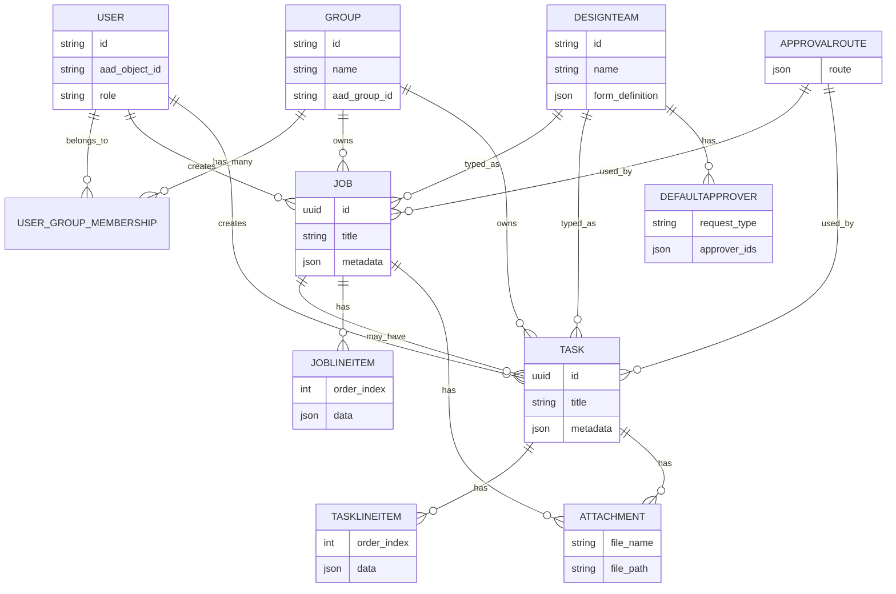
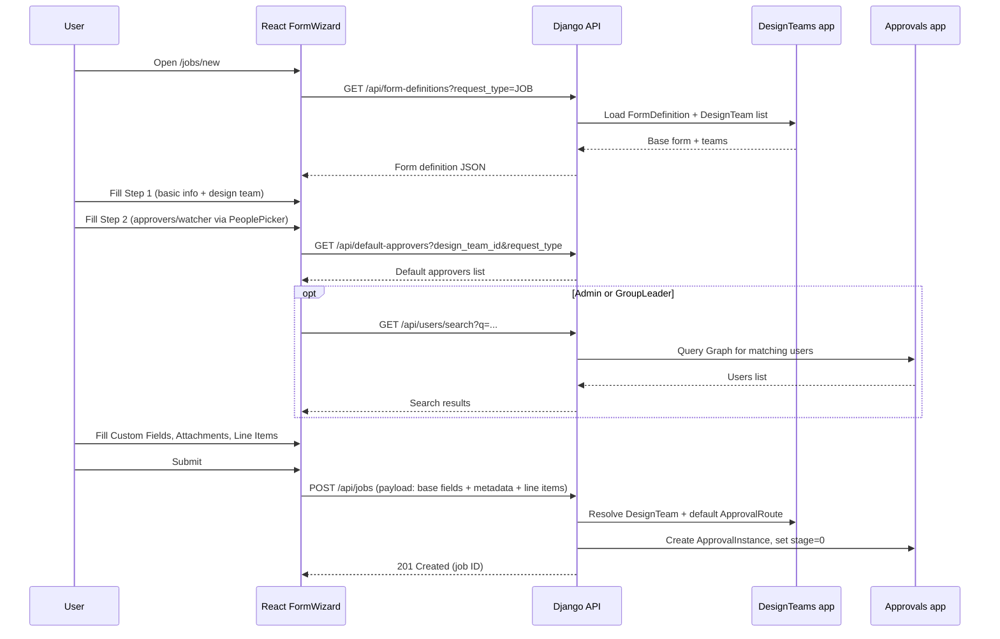
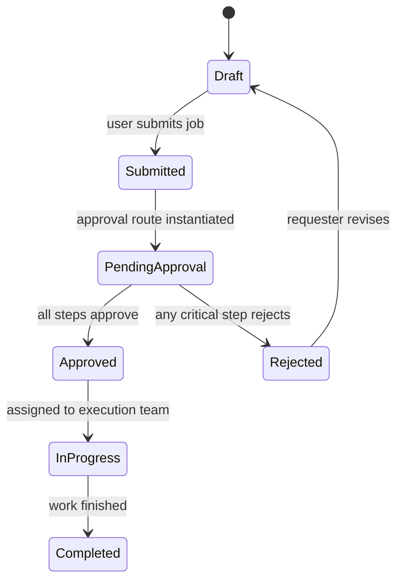
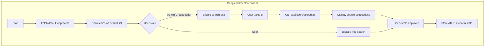
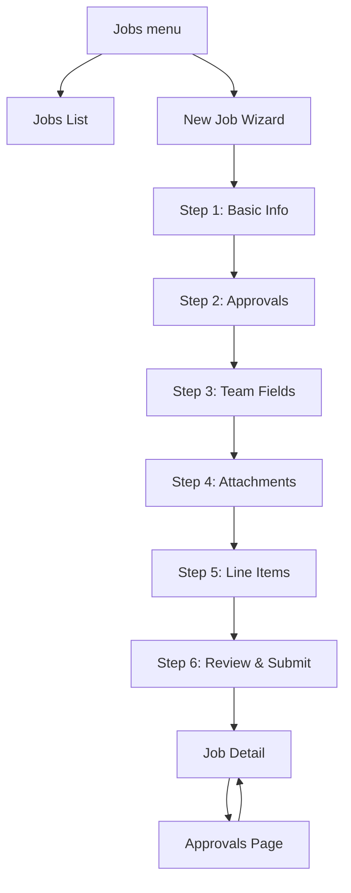

# Full-Stack Masterplan for Local Design-Job/Task Portal (Django + React + Waitress)

> This masterplan consolidates and structures the content from the earlier architecture, full-stack, and lookup/approval planning documents into one cohesive reference. It covers the **system blueprint**, the **engineering skeleton**, and **Mermaid diagrams** for architecture, flows, and state machines.citeturn28search2turn28search3turn28search4

---

## 1. Goals, Scope, and Roles

### 1.1 Business Goal

Build a **localized ticketing / design-request portal** for a small engineering team within an organization, running on a **Windows 11 local server** using **Django** as backend, **React** as frontend, and **Waitress** as the WSGI server.citeturn28search3turn28search4  
The portal will:

- Accept **design job requests** (e.g., PCB, Drawing, Hardware, Firmware).citeturn28search4  
- Support **stand-alone tasks** or tasks under jobs.citeturn28search4turn28search3  
- Route items through **approval workflows** with configurable default routes and approvers.citeturn28search2turn28search3  
- Integrate with **Azure AD / Okta** for identity and **Microsoft Graph** for directory search and notifications.citeturn28search3turn28search4  
- Store **attachments** in SharePoint/OneDrive or local/network storage, with metadata in the DB.citeturn28search4turn28search3  

### 1.2 Key Roles

- **Requester (User)** – Submits jobs and tasks; sees items in their team or where they are explicitly included.
- **Group Leader** – Triages requests, assigns tasks, can override approval defaults for their teams.
- **Approver** – Reviews and approves/declines items as part of an approval route.
- **Admin** – Manages users, roles, design teams, routes, and system configuration.

### 1.3 High-Level Requirements

- Multi-step, dynamic forms for Jobs and Tasks (type + design team drive different fields).citeturn28search2turn28search3  
- Inline editable tables for line items (e.g., BOM details).citeturn28search3turn28search4  
- Attachments for each Job/Task.citeturn28search3turn28search4  
- People Picker integrated with corporate directory for approvers and watchers; restricted by role.citeturn28search2turn28search3  
- Default approval routes and approvers per design team and request type.citeturn28search2turn28search3  
- RBAC and scoping by group/department.citeturn28search4turn28search3  

---

## 2. System Architecture Blueprint

### 2.1 Component Overview (Mermaid)

```mermaid
flowchart LR
    subgraph Client[Client Layer]
        U[User Browser]
    end

    subgraph FE[React Front-End]
        FW[FormWizard]
        PP[PeoplePicker]
        ET[EditableTable]
        LD[Layout + Dashboard]
    end

    subgraph BE[Django Backend]
        API[REST API (DRF)]
        ACC[accounts app]
        DT[design_teams app]
        JB[jobs app]
        TK[tasks app]
        AP[approvals app]
        NT[notifications app]
        DB[(PostgreSQL)]
    end

    subgraph INT[Integrations]
        AD[(Azure AD/Okta)]
        MSGraph[Microsoft Graph]
        SP[SharePoint/OneDrive]
    end

    U --> FE
    FE -->|HTTP JSON| API
    API --> ACC
    API --> DT
    API --> JB
    API --> TK
    API --> AP
    API --> NT
    ACC --> DB
    DT --> DB
    JB --> DB
    TK --> DB
    AP --> DB

    ACC <-->|OIDC/SAML| AD
    NT -->|Mail, Users| MSGraph
    JB -->|File metadata| SP
```

This diagram shows the React front-end (FormWizard, PeoplePicker, EditableTable, Layout), the Django app-layer modules (accounts, design_teams, jobs, tasks, approvals, notifications) and external services (Azure AD/Okta, Microsoft Graph, SharePoint).citeturn28search3turn28search4turn28search2

### 2.2 Backend Logical Components

Backend is structured as multiple Django apps under `apps/`:citeturn28search4turn28search3  

- **accounts** – User model extension, Group, UserGroupMembership, SSO integration, RBAC helpers.
- **design_teams** – DesignTeam, FormDefinition, DefaultApprover management.
- **jobs** – Job, JobLineItem, job-specific business logic and APIs.
- **tasks** – Task, TaskLineItem, task logic.
- **approvals** – ApprovalRoute templates, ApprovalInstance tracking.
- **notifications** – Email/Teams notifications via Graph API.
- **dashboard** – Read-only aggregated views and metrics endpoints.

### 2.3 Front-End Logical Components

Frontend components (React-based) mirror backend domains:citeturn28search4turn28search3  

- **Layout**: Shared shell (header, sidebar, footer, theme switch).
- **Pages**: Dashboard, Jobs (list/new/detail), Tasks (list/new/detail), Approvals, Management, Admin, Config/Settings.
- **FormWizard**: Multi-step engine; consumes form definitions from `/api/form-definitions`.
- **FieldRenderer**: Maps field definitions to input controls.
- **PeoplePicker**: Directory lookup & default approver UI.
- **EditableTable**: Inline table editor for line items.
- **AttachmentUploader**: File upload UI.

---

## 3. Data & Domain Model (Conceptual)

### 3.1 Entity Overview (ERD – Mermaid)



This ERD maps exactly to the concepts described in the Django plans: extended user and group models, design teams, jobs/tasks with JSON metadata, line items as child records, attachments, and configuration tables for routes and default approvers.citeturn28search3turn28search2turn28search4

### 3.2 Metadata & Dynamic Fields

- Each Job/Task has `metadata` JSON, including:
  - `custom_fields` – Filled from `DesignTeam.form_definition` and `FormDefinition.definition`.
  - `approver_ids` – Ordered array of AD object IDs selected via PeoplePicker.
  - `watcher_ids` – Additional AD object IDs for watchers.
  - `approval_stage` – Index or stage label for current approval step.
- JSON usage allows adding or changing fields without altering the relational schema.citeturn28search3turn28search2

---

## 4. Key Application Flows

### 4.1 Job Creation – Sequence Diagram



This diagram expresses the multi-step job creation process with default and directory-based approver selection as defined in the lookup and full‑stack plans.citeturn28search2turn28search3

### 4.2 Approval Workflow – State Machine



States (Draft, Submitted, PendingApproval, Approved, InProgress, Completed, Rejected) represent Job lifecycle stages derived from the approvals and jobs planning documents.citeturn28search3turn28search4

### 4.3 People Picker – Flow Diagram



Ordinary users operate only with default lists; elevated roles can search the directory, as described by the lookup plan.citeturn28search2turn28search3

---

## 5. Engineering Skeleton – Backend

### 5.1 Backend Folder Layout (Django)

High-level structure adapted from the architecture plan:citeturn28search4turn28search3  

- `DesignPortal/` (root)
  - `manage.py`
  - `requirements.txt`
  - `.env.example`
  - `config/`
    - `__init__.py`
    - `base.py` (common settings: installed apps, DB, DRF, CORS, auth backends)
    - `dev.py` (DEBUG on, local DB)
    - `prod.py` (DEBUG off, allowed hosts, static config)
  - `apps/`
    - `accounts/` (User, Group, membership, role mapping, SSO)
    - `design_teams/` (DesignTeam, FormDefinition, DefaultApprover)
    - `jobs/` (Job, JobLineItem, job APIs)
    - `tasks/` (Task, TaskLineItem, task APIs)
    - `approvals/` (ApprovalRoute, ApprovalInstance, approval APIs)
    - `notifications/` (Graph email client, Celery tasks, signals)
    - `dashboard/` (metrics endpoints)
  - `static/` (collected static assets)
  - `media/` (local upload area if needed)
  - `docs/` (architecture docs like this masterplan)

### 5.2 Responsibility Matrix per Backend App

- **accounts** –
  - Manage local user records keyed by Azure AD object IDs.
  - Map AD/Okta roles/groups into `User.role` and `Group` membership.citeturn28search4turn28search3  
  - Provide DRF permission classes for Admin, GroupLeader, User.

- **design_teams** –
  - Maintain list of design teams: PCB, Drawing, Hardware, Firmware.
  - For each, store JSON `form_definition` for team-specific fields.
  - Maintain `DefaultApprover` and global `FormDefinition`.

- **jobs** –
  - CRUD endpoints for Job records.
  - Handle multi-step payload: base fields, `metadata`, line items, attachments.
  - Enforce mandatory fields from `FormDefinition` and `DesignTeam.form_definition`.citeturn28search3turn28search2  

- **tasks** –
  - Similar responsibilities for Task records, optionally linked to a Job.

- **approvals** –
  - Manage `ApprovalRoute` templates and instantiate `ApprovalInstance` when a job is submitted.
  - Progress approvals based on decisions, update status/metadata, and trigger notifications.citeturn28search2turn28search3turn28search4  

- **notifications** –
  - Interface with Graph API to send notifications.
  - Manage email templates and event-based triggers.

- **dashboard** –
  - Provide summaries for jobs and tasks by status, design team, group, etc., for the Dashboard page.

### 5.3 API Surface Summary

As consolidated from the plans:citeturn28search3turn28search2  

- **Authentication**: `/api/auth/login/`, optionally SSO callbacks.
- **Configuration**:
  - `/api/design-teams/` – list and manage design teams.
  - `/api/form-definitions/` – list, view, update multi-step form definitions.
  - `/api/config/approval-routes/` – manage approval route templates.
  - `/api/default-approvers/` – manage and query default approver lists.
- **Directory lookup**: `/api/users/search/?q=...` – restricted to Admin/GroupLeader.
- **Defaults retrieval**: `/api/default-approvers/?design_team_id&request_type` – available to all.
- **Jobs & Tasks**:
  - `/api/jobs/` (GET list, POST create)
  - `/api/jobs/{id}/` (GET detail, PUT/PATCH, DELETE as allowed)
  - `/api/jobs/{id}/approve/` (approval action)
  - Similar endpoints for `/api/tasks/`.
- **Attachments**:
  - `/api/jobs/{id}/attachments/` and `/api/tasks/{id}/attachments/` – upload/list attachments.
- **Dashboard**:
  - `/api/dashboard/metrics/` – summary data for front-end charts.

### 5.4 Waitress Hosting on Windows 11

- Install Waitress into the Python virtual environment.
- Confirm that `config/wsgi.py` (or equivalent) exposes `application`.
- Run the server for local deployment:
  - `waitress-serve --listen=0.0.0.0:8000 config.wsgi:application` (adjust module name to your project).citeturn28search4  
- Set up a Windows Service or Scheduled Task to run this command on startup.
- Optionally place a reverse proxy (IIS/Nginx) in front for HTTPS, compression, and static serving.citeturn28search4  

---

## 6. Engineering Skeleton – Front-End

### 6.1 Front-End Folder Layout

Based on the architecture plan and full-stack documents:citeturn28search4turn28search3  

- `frontend/`
  - `package.json`
  - `src/`
    - `index.jsx` or `main.jsx`
    - `App.jsx` (layout + router)
    - `theme/`
      - `variables.css` – global colors, typography, glass blur/opacity.
      - `glass.css` – frosted card classes.
    - `components/`
      - `Layout.jsx` – header, collapsible sidebar, footer.
      - `FormWizard.jsx`
      - `FieldRenderer.jsx`
      - `EditableTable.jsx`
      - `PeoplePicker.jsx`
      - `AttachmentUploader.jsx`
      - `ChartWidgets.jsx`
    - `pages/`
      - `Dashboard.jsx`
      - `JobsList.jsx`, `JobNew.jsx`, `JobDetail.jsx`
      - `TasksList.jsx`, `TaskNew.jsx`, `TaskDetail.jsx`
      - `Approvals.jsx`
      - `Manage.jsx` (triage tools)
      - `Admin/Users.jsx`, `Admin/Routes.jsx`, `Admin/Config.jsx`
      - `Settings.jsx`
    - `services/`
      - `api.js` – Axios instance + typed API functions
      - `auth.js` – wrappers for login and token handling
    - `context/`
      - `AuthContext.jsx`
      - `ThemeContext.jsx`
      - `FormContext.jsx`

### 6.2 Major Front-End Flows (Mermaid 페이지 View)



This illustrates the multi-step wizard, its relationship to Jobs list/detail pages, and how the Approvals page ties back.citeturn28search2turn28search3turn28search4  

---

## 7. Step-by-Step “How To” Summary

1. **Plan & Initialize**
   - Use this masterplan as baseline.  Create Git repository with `backend` (Django) and `frontend` (React) directories.
2. **Backend First**
   - Implement apps and models as per Section 5; run migrations.
   - Configure Azure AD/Okta and verify login via Django auth.
   - Implement DRF viewsets and routes; verify with curl/Postman.
3. **Front-End Integration**
   - Scaffold React app; implement Layout, FormWizard, and pages.
   - Wire React to DRF APIs; confirm job create/list/detail flows.
4. **Directory Lookup & Approvals**
   - Configure Graph app; implement PeoplePicker endpoints; secure them by role.
   - Configure DefaultApprover and ApprovalRoute; test multi-step approvals.
5. **Attachments & Files**
   - Hook AttachmentUploader to backend; confirm file upload & retrieval via SharePoint/OneDrive (or local storage in dev).
6. **Waitress Deployment**
   - On Windows 11, run Waitress with Django’s wsgi.
   - Optionally integrate with IIS or Nginx as reverse proxy.
7. **Hardening & Observability**
   - Add logging, audit trails, metrics, and dashboard endpoints.
   - Add tests and CI on each push.

---

## 8. Closing Notes

All pieces in this masterplan come from your original architecture plan, the Django full-stack plan, and the lookup/default approver additions, now merged into ONE consistent design.citeturn28search2turn28search3turn28search4  

You can evolve this document by:
- Adding more Mermaid diagrams for deeper use cases.
- Expanding the FormDefinition JSON specifications per request type.
- Detailing UI wireframes aligned with this structure.

Use this as the **single source of truth** for your localized design-ticketing system.
